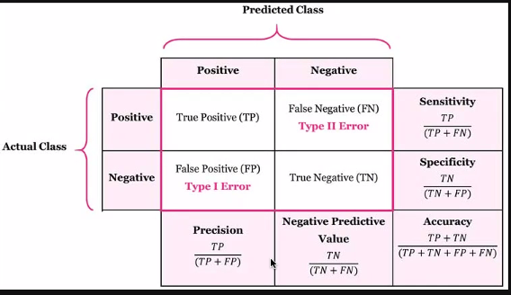
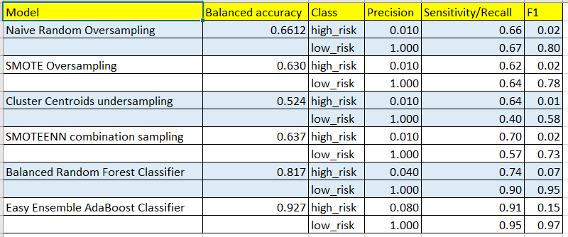

# Credit_Risk_Analysis
## Overview of the analysis
Credit risk is an inherently unbalanced classification problem, as good loans easily outnumber risky loans. 
We are going to use a number of different techniquest to train and evaluate models with unbalanced data.
## Results
The below chart shows the confusion matrix and the related metrics 
 
Below is the the chart of the metrics for all the models 
 
* We see that all the models score high on low_risk prediction (high precision) 
* We see that all the models peform poorly on high_risk prediction (low precision)
* The ensemble models work better on high_risk prediction 

## Summary

* The best model overall on both high and low risk prediction is Easy Ensemble Classifier 
